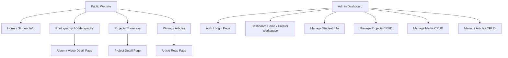

# Sitemap

Peta situs (*Sitemap*) ini mendefinisikan seluruh halaman yang ada pada **Public Website** dan **Admin Dashboard**.

---

## 1. Public Website

Halaman-halaman yang dapat diakses oleh publik secara bebas:

### A. Home (Student Info) - `/`
Halaman utama yang memperkenalkan identitas Rifqi sebagai mahasiswa.
* **Hero Section**: Tagline, biografi singkat, dan status saat ini (sedang mengerjakan apa).
* **Highlighted Section**: Cuplikan proyek terbaru, foto terbaru, dan artikel terbaru.
* **Competence & Organization**: Daftar keahlian akademis/non-akademis, riwayat organisasi, pencapaian kompetisi.
* **Contact & Links**: Link media sosial, email, dan unduh Resume/CV.

### B. Photography & Videography - `/gallery`
Dokumentasi karya visual.
* **Gallery Grid**: Daftar album foto tematik dan video.
* **Behind the Scenes**: Cuplikan cerita atau catatan kecil tentang pembuatan karya.
* **Album Detail - `/gallery/:album-slug`**:
  * Judul album, deskripsi konsep/cerita.
  * Tampilan foto-foto besar dengan lightbox viewer.
  * Tautan video (jika berupa video).

### C. Projects - `/projects`
Daftar seluruh proyek (coding, riset, proposal, event, video dokumenter).
* **Project Filter & Grid**: Filter berdasarkan tipe (Web, Research, Event, Video, dsb).
* **Project Detail - `/projects/:project-slug`**:
  * Deskripsi mendalam, tantangan, solusi, dan cerita pembuatan.
  * Media pendukung (foto pameran, diagram arsitektur, proposal PDF, atau video).
  * Tautan eksternal (GitHub, Demo Live, Laporan Penelitian).

### D. Writing - `/writing`
Catatan, refleksi, dan artikel.
* **Article List**: Daftar artikel dengan tanggal publikasi dan estimasi waktu baca.
* **Article Detail - `/writing/:article-slug`**:
  * Halaman baca artikel dengan format tipografi yang optimal untuk pembacaan lama (*clean typography*).

---

## 2. Admin Dashboard (CMS Workspace)

Halaman terbatas untuk pengelolaan konten (CMS) oleh Rifqi:

### A. Login - `/admin/login`
* Halaman autentikasi administrator menggunakan *username* dan *password*.

### B. Workspace Home (Dashboard) - `/admin`
* Halaman utama admin yang berfokus pada aksi cepat: tombol "Unggah Karya Foto", "Tulis Artikel", "Tambah Proyek Baru", dan daftar draf konten yang sedang dikerjakan.

### C. Manage Student Info - `/admin/profile`
* Formulir untuk memperbarui status saat ini, teks biografi hero, daftar organisasi, kompetensi, dan file CV/Resume.

### D. Manage Projects - `/admin/projects`
* Daftar semua proyek.
* Form Tambah/Edit Proyek (Judul, Tipe, Deskripsi, Cover Image, Galeri Proyek, Status: Draf/Publish).
* Hapus Proyek.

### E. Manage Media - `/admin/gallery`
* Daftar album foto dan video.
* Form Tambah/Edit Album (Judul, Cerita/Deskripsi, Upload Foto, Tautan Video Youtube/Vimeo, Status: Draf/Publish).
* Hapus Album.

### F. Manage Writing - `/admin/writing`
* Daftar artikel.
* Editor artikel (Rich Text / Markdown editor sederhana).
* Pengaturan artikel (Status: Draf/Publish, Kategori, Tanggal rilis).
* Hapus Artikel.
