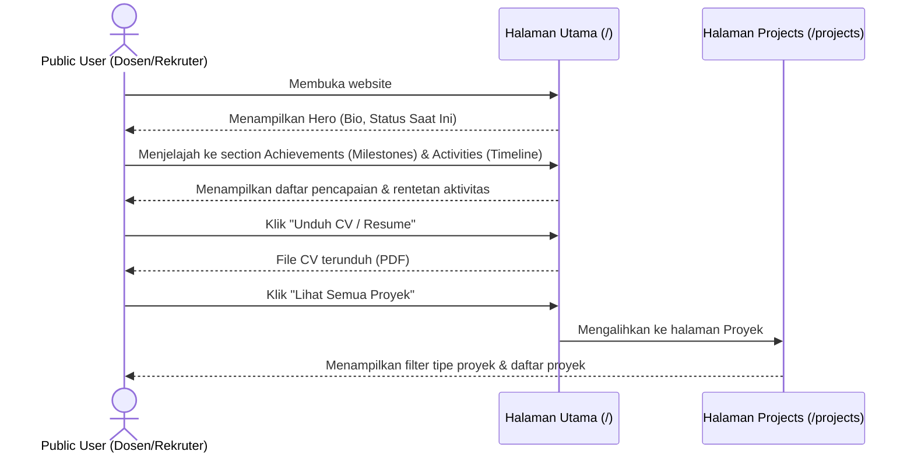
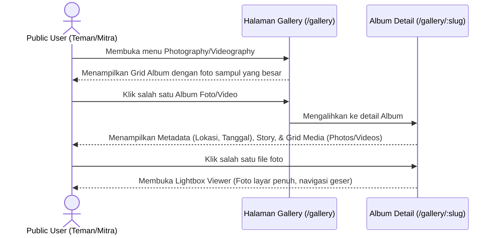
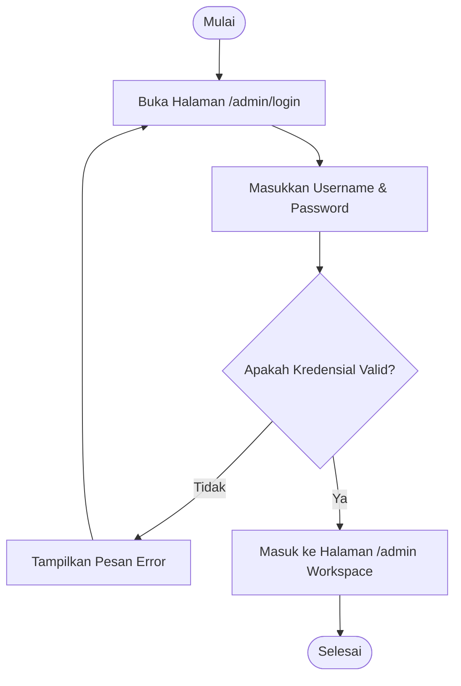

# User Flow

Dokumen ini mendefinisikan alur pengguna (*User Flow*) untuk dua aktor utama:
1. **Public User** (Dosen, Rekruter, Teman, Mitra Kolaborasi).
2. **Admin** (Rifqi Abdullah).

---

## 1. Public User Flow

### A. Alur Menjelajahi Profil & Aktivitas
Tujuan: Menilai identitas diri, pencapaian terbaru, riwayat aktivitas, dan kompetensi Rifqi.



### B. Alur Mengapresiasi Karya Visual & Cerita (Photography/Videography)
Tujuan: Menikmati dokumentasi karya fotografi/videografi beserta konsep cerita, lokasi, dan tanggal di belakangnya.



---

## 2. Admin Flow (Rifqi as CMS User)

### A. Alur Awal: Login & Masuk Workspace (Single Admin CMS)
Tujuan: Masuk ke dalam CMS secara aman tanpa adanya registrasi atau lupa password.



### B. Alur Mengelola Album Baru (Albums, Photos, Videos)
Tujuan: Mengunggah album baru dengan metadata (lokasi, tanggal, cover) dan menambahkan foto/video ke dalamnya.

```mermaid
graph TD
    Start([Mulai di Halaman /admin]) --> ClickAddAlbum[Klik "Buat Album Baru"]
    ClickAddAlbum --> OpenForm[Buka Form Album]
    OpenForm --> InputData[Masukkan Judul, Lokasi, Tanggal, Story]
    InputData --> UploadCover[Upload File Sampul Album]
    UploadCover --> SelectStatus{Pilih Status}
    SelectStatus -- Draf --> SaveDraft[Simpan sebagai Draf]
    SelectStatus -- Publish --> SavePublish[Simpan & Terbitkan]
    SaveDraft --> DBSave[(Simpan ke Tabel albums)]
    SavePublish --> DBSave
    DBSave --> OpenAlbumDetail[Buka Halaman Detail Album di CMS]
    OpenAlbumDetail --> ClickUploadMedia[Klik "Unggah Media Foto/Video"]
    ClickUploadMedia --> UploadMediaFiles[Upload File Foto/Video ke album_photos / album_videos]
    UploadMediaFiles --> End([Selesai])
```

### C. Alur Mengunggah Proyek Baru
Tujuan: Menambah proyek baru (Web, Riset, Event, dll) dengan opsi galeri pendukung dan tautan luar.

```mermaid
graph TD
    Start([Mulai di Halaman /admin]) --> ClickAddProject[Klik "Tambah Proyek Baru"]
    ClickAddProject --> OpenFormProject[Buka Form Proyek]
    OpenFormProject --> InputDetails[Masukkan Judul, Tipe Proyek, Deskripsi, Markdown Content]
    InputDetails --> UploadCover[Upload Cover Gambar]
    UploadCover --> AddGallery[Unggah Foto Galeri Pendukung - Opsional]
    AddGallery --> AddLinks[Masukkan Tautan Demo/Github - Opsional]
    AddLinks --> SaveProject[(Simpan ke Tabel projects)]
    SaveProject --> End([Selesai])
```
