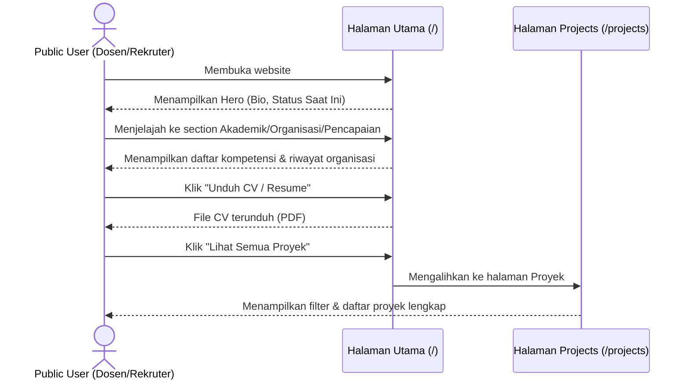
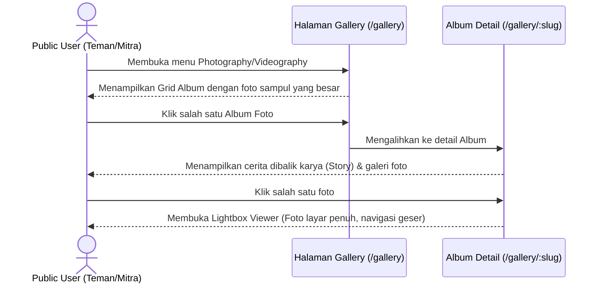

# User Flow

Dokumen ini mendefinisikan alur pengguna (*User Flow*) untuk dua aktor utama:
1. **Public User** (Dosen, Rekruter, Teman, Mitra Kolaborasi).
2. **Admin** (Rifqi Abdullah).

---

## 1. Public User Flow

### A. Alur Menjelajahi Profil Akademik & Aktivitas (Untuk Dosen & Rekruter)
Tujuan: Menilai kualifikasi akademis, organisasi, dan keahlian Rifqi.



### B. Alur Mengapresiasi Karya Visual & Cerita (Untuk Mitra & Teman)
Tujuan: Menikmati dokumentasi karya fotografi/videografi beserta proses kreatif di belakangnya.



---

## 2. Admin Flow (Rifqi as CMS User)

### A. Alur Awal: Login & Masuk Workspace
Tujuan: Masuk ke dalam CMS secara aman.


### B. Alur Mengunggah Karya Baru (Photography/Videography)
Tujuan: Mengunggah album foto tematik dengan cerita di baliknya.

```mermaid
graph TD
    Start([Mulai di Halaman /admin]) --> ClickAddMedia[Klik "Unggah Karya Baru"]
    ClickAddMedia --> OpenForm[Buka Form Upload Media]
    OpenForm --> InputData[Masukkan Judul Album, Deskripsi Cerita, Kategori]
    InputData --> UploadImages[Upload File Foto Utama & File Pendukung]
    UploadImages --> SelectStatus{Pilih Status Publikasi}
    SelectStatus -- Draf --> SaveDraft[Simpan sebagai Draf]
    SelectStatus -- Publish --> SavePublish[Simpan & Publikasikan]
    SaveDraft --> DBSave[(Simpan ke Database)]
    SavePublish --> DBSave
    DBSave --> RedirectList[Kembali ke Daftar Media & Tampilkan Notifikasi Sukses]
    RedirectList --> End([Selesai])
```

### C. Alur Menulis Artikel Baru (Writing)
Tujuan: Membuat draf tulisan, mengedit, dan menerbitkannya.

```mermaid
graph TD
    Start([Mulai di Halaman /admin]) --> ClickWrite[Klik "Tulis Artikel Baru"]
    ClickWrite --> OpenEditor[Buka Editor Artikel]
    OpenEditor --> WriteContent[Tulis Judul & Konten dengan Markdown/Rich Text]
    WriteContent --> SetSlug[Tentukan Slug URL & Kategori]
    SetSlug --> SetStatus{Tentukan Status}
    SetStatus -- Simpan Draf --> SaveDraft[Simpan ke DB dengan status Draft]
    SetStatus -- Terbitkan --> SavePublish[Simpan ke DB dengan status Published]
    SaveDraft --> RedirectList[Kembali ke Daftar Tulisan]
    SavePublish --> RedirectList
    RedirectList --> End([Selesai])
```
